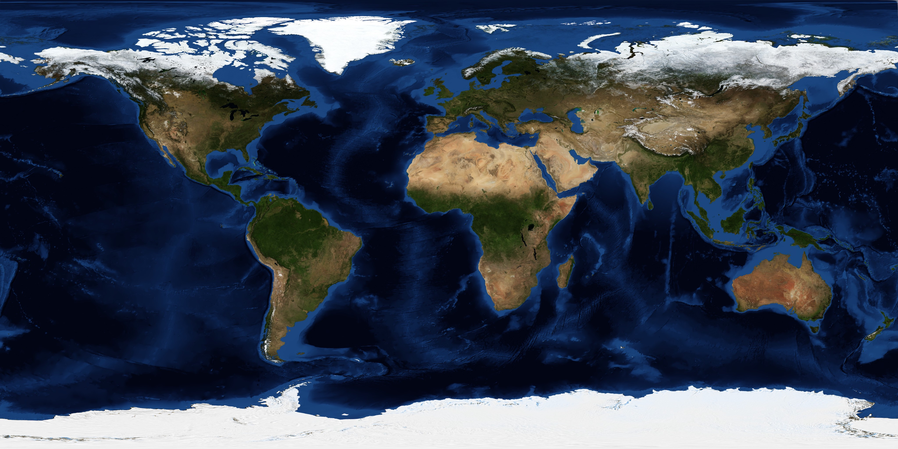

# Hexasphere.js

A modern JavaScript library for creating hexagon-tiled spheres using Three.js. This implementation generates geodesic polyhedrons with hexagonal tiles covering most of the sphere surface, with exactly 12 pentagonal tiles at the vertices of the original icosahedron.

## Features

- **Modern Three.js Integration**: Built with the latest Three.js for optimal performance
- **TypeScript Support**: Full TypeScript definitions included
- **Modular Architecture**: Clean, maintainable code structure
- **Flexible Configuration**: Customizable sphere radius, subdivision levels, and tile properties
- **Multiple View Modes**: Choose between tile-based, planet mesh, or hybrid rendering
- **Terrain Integration**: Support for elevation data and realistic planet surfaces
- **Texture Mapping**: Automatic UV mapping and texture support for realistic visuals
- **Interactive Features**: Tile selection, pathfinding, and dynamic coloring
- **Export Capabilities**: Export to OBJ format for 3D modeling software
- **Interactive Demos**: Multiple example implementations included

## Installation

```bash
npm install
```

## Usage

### Basic Example

```javascript
import * as THREE from 'three';
import { Hexasphere } from './src/hexasphere.js';

const scene = new THREE.Scene();
const radius = 15;
const subdivisions = 5;
const tileWidth = 0.9;
const viewMode = 'tile'; // 'tile', 'planet', or 'both'

const hexasphere = new Hexasphere(radius, subdivisions, tileWidth, scene, viewMode);

// Access tile data
hexasphere.getTiles().forEach(tile => {
    console.log('Center:', tile.centerPoint);
    console.log('Boundary:', tile.boundary);
    console.log('Neighbors:', tile.neighbors);
});

// Export to OBJ format
const objString = hexasphere.toObj();
```

### Three.js Integration

```javascript
import * as THREE from 'three';
import { Hexasphere } from './src/hexasphere.js';

const scene = new THREE.Scene();
const camera = new THREE.PerspectiveCamera(75, window.innerWidth / window.innerHeight, 0.1, 1000);
const renderer = new THREE.WebGLRenderer();

const hexasphere = new Hexasphere(10, 4, 0.9, scene, 'tile');

// The hexasphere automatically adds meshes to the scene based on viewMode
// No additional geometry creation needed for basic usage
```

## API Reference

### Hexasphere Constructor

```javascript
new Hexasphere(radius, subdivisions, tileWidth, scene, viewMode)
```

- `radius` (number): Sphere radius
- `subdivisions` (number): Number of subdivisions per icosahedron edge
- `tileWidth` (number): Tile size factor (0.1 = mostly padding, 1.0 = no padding)
- `scene` (THREE.Scene): Three.js scene to add meshes to
- `viewMode` (string): Rendering mode - `'tile'`, `'planet'`, or `'both'`

### Methods

- `toObj()`: Export sphere as Wavefront OBJ format string
- `toJson()`: Export sphere data as JSON string
- `getTiles()`: Get array of all tiles
- `getPlanetMesh()`: Get the planet mesh (when using 'planet' or 'both' viewMode)
- `setTileColor(index, color)`: Set color of specific tile
- `findPath(startTile, endTile)`: Find shortest path between two tiles

## View Modes

Hexasphere supports three different rendering modes controlled by the `viewMode` parameter:

### 'tile' Mode
- Renders individual hexagonal tiles as separate meshes
- Each tile can be colored and selected independently
- Best for tile-based gameplay and detailed terrain visualization

### 'planet' Mode
- Renders a smooth spherical mesh with elevation data
- Uses terrain information to displace vertices for realistic height variation
- Best for planetary visualization and smooth terrain rendering

### 'both' Mode
- Renders both tile meshes and planet mesh simultaneously
- Useful for debugging or hybrid visualization needs

```javascript
// Tile mode - individual hexagonal tiles
const tileSphere = new Hexasphere(15, 5, 0.9, scene, 'tile');

// Planet mode - smooth sphere with elevations
const planetSphere = new Hexasphere(15, 5, 0.9, scene, 'planet');

// Both modes - tiles and planet together
const hybridSphere = new Hexasphere(15, 5, 0.9, scene, 'both');
```

## Texture Support

HexaSphere automatically applies textures to both planet meshes and individual tiles when available:

### Automatic Texture Loading
- Uses equirectangular projection images for realistic surface mapping
- Automatically generates UV coordinates for proper texture alignment
- Supports both planet and tile rendering modes
- Default Earth texture (`earth-blue-marble.jpg`) provides realistic planetary appearance

### Texture Requirements
- Images should be in equirectangular projection format
- Place texture images in your project directory
- The default texture is `earth-blue-marble.jpg` for realistic Earth appearance

```html

```

### Texture Features
- **Planet Mode**: Full spherical texture mapping with elevation displacement
- **Tile Mode**: Individual tile textures with terrain-based coloring
- **Both Mode**: Combined rendering with both mesh types textured

### Tile Properties

Each tile in `hexasphere.tiles` contains:

- `centerPoint`: 3D coordinates of tile center
- `boundary`: Array of boundary vertices
- `neighbors`: Array of neighboring tile indices

## Examples

Check out the included example files:

- `index.html` - Full-featured demo with controls
- `index-light.html` - Minimal implementation
- `create_terrain_map.html` - Terrain mapping example

## Development

```bash
# Install dependencies
npm install

# Build the library
npm run build

# Start development server
npm run dev
```

## License

MIT License - feel free to use in your projects.